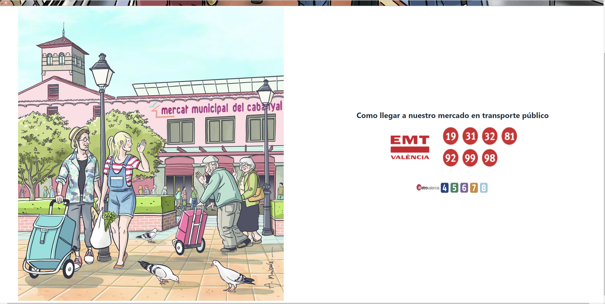
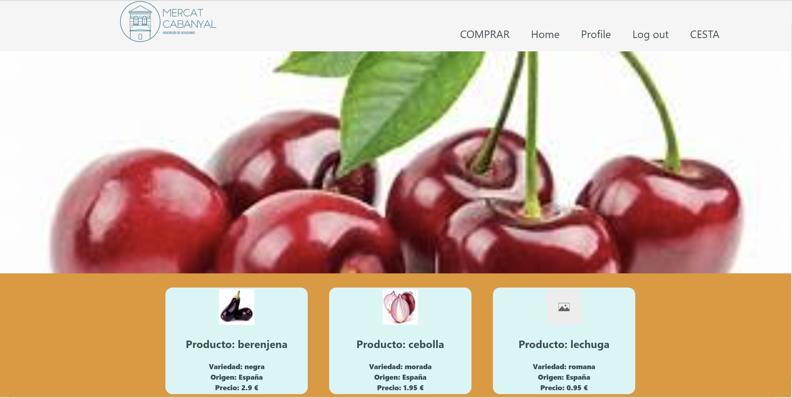
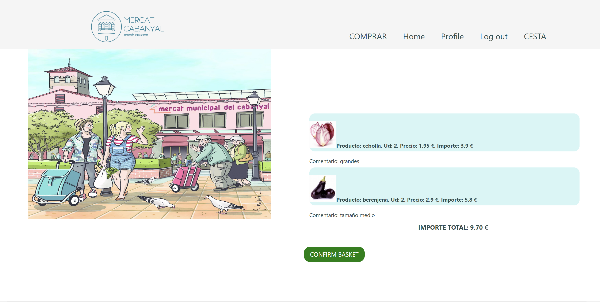
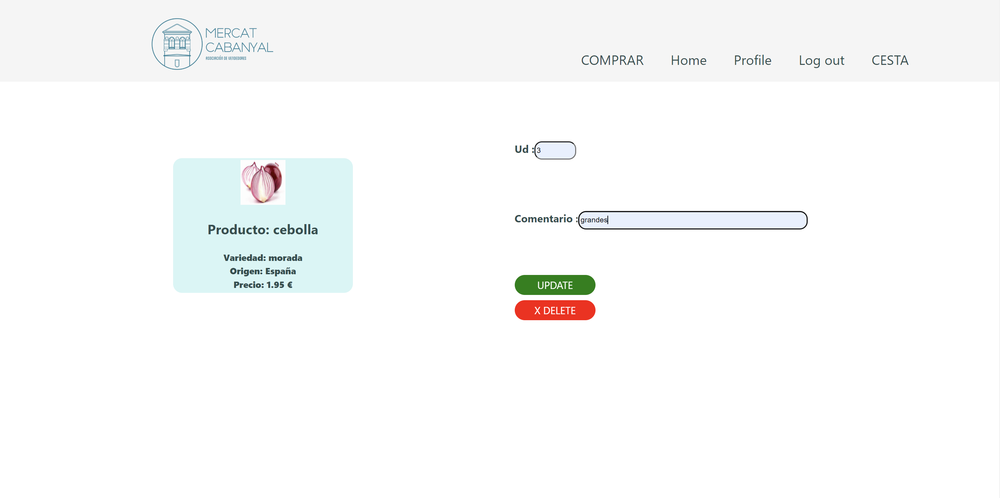
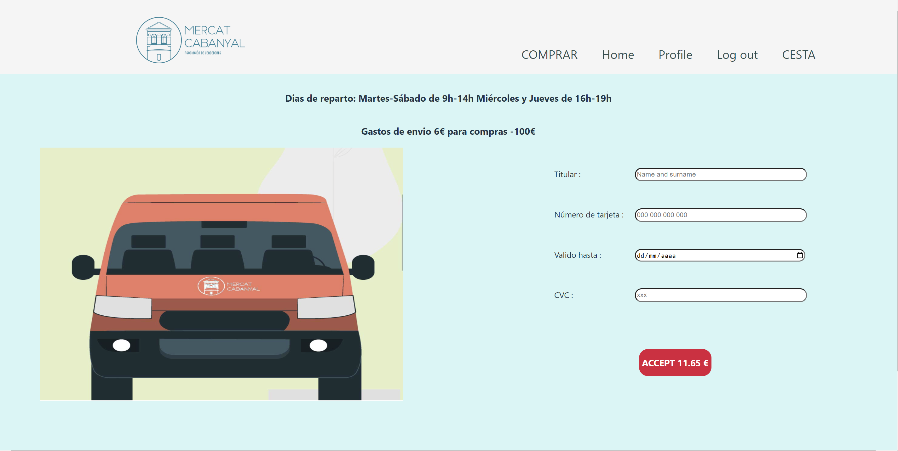
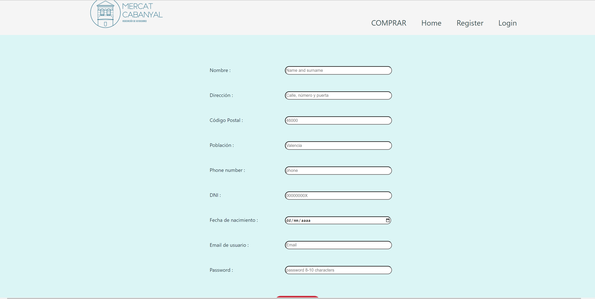
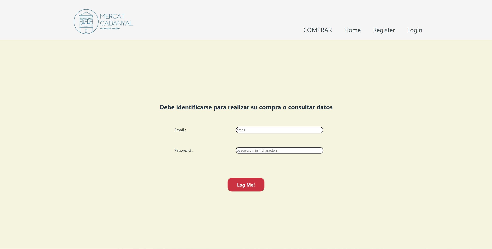

<h1>  FRONTEND E-COMMERC MERCADO  </h1>

**Proyecto Final FRONTEND e-commerc de un mercado  (Bootcamp Full Stack Developer en GeeksHubs Academy)**


# Table of Contents

- ### 🚀 [Descripcion](#descripción-del-proyecto)
- ### 🎯 [Objetivo aplicacion](#objetivo-de-la-aplicación)
- ### 👩🏽‍💻 [Tecnologias](#tecnologías)
- ### 👀 [Vistas](#vistas)
- ### 🔝 [Mejoras](#futuras-mejoras)
- ### ⚙️ [Instrucciones aplicación](#instrucciones-de-instalación-local)


## Descripción del Proyecto

Este proyecto es el frontend de un sistema de gestión compras de productos de un mercado municipal, que complementa el backend desarrollado conjuntamente.
 En esta aplicación, podemos registrarnos como nuevos usuarios, y loguearnos para poder acceder al resto de la aplicación.
 A la hora de realizar el login, se diferencia entre usuario, admin y super-admin, cambiando el header dependiendo del acceso al que se está permitido, dependiendo del role al que pertenece.
 El proyecto está desarrollado para realizar todas las funciones necesarias para realizar la compra un usuario. El backend está preparado para implementar muchas más funciones en este frontend, pero que no ha sido posible aplicarlas todas. Es una de las mejoras que detallaré más adelante.
 En el caso de tener un role super-admin, puede acceder a otro menú exclusivo donde puede realizar el listado de todos los usuarios, autorización a vendedores para poder registrarse como tal, generar nuevas categorías, etc.
 También habrá un apartado exclusivo de vendedores, que accederán por el login de user y serán redirigidos a otro menú, donde podrán gestionar sus productos, y desactivarse en caso de no querer seguir vendiendo online por enfermedad, vacaciones, etc.


## Objetivo de la aplicación

- Registro, login y modificación de datos de usuarios.
- Crear una cesta de compra de forma fácil e intuitiva.
- Funcionalidades adicionales para el superadmin (mejoras).


## Tecnologías

El frontend ha sido desarrollado utilizando tecnologías como React, Redux,  Javascript, HTML, Bootstrap, CSS, GIT y GitHub.
</br>
</br>
[]()
[]()
[]()
[]()
[]()
</br>
</br>

## Vistas

A continuación se muestran algunas imágenes de las vistas del proyecto:

###- Vista de Home:


Se puede observar el header sin la opción de cesta, ya que el usuario no está logeado. Puede empezar a comprar, pero al acceder al producto para generar el pedido, le redirigirá a la pantalla de login para poder realizar la compra, y aparecerá CESTA en el header.
Se puede acceder a la CESTA en cualquier momento de la compra, además de aparecer en la cesta los productos que pudiera haber cargado en ella, pero no finalizó el pago en algún momento.
Se controla mediante el campo 'invoiced' de la tabla order.


###- Vista de los tipos de producto:

Muestra los diferentes tipos de género que se pueden vender en un mercado.
Pulsando en cada uno de ellos, muestra los vendedores que venden ese tipo de artículos.


###- Vista de Vendedores:

Se muestran los vendedores que pertenecen al gremio seleccionado.

###- Vista de productos del vendedor:

Muestra los productos del vendedor, con sus características. En la parte principal de la pantalla, aparece la imagen que el vendedor incluye en su registro de vendedor, ya sea imagen de sus productos o logotipo de su tienda.


###- Vista de creación de pedido. 

Debe de introducir las unidades y un comentario, en el caso de ser necesario, sobre la forma de preparación de su producto, ya sea el tipo de corte, envasado, etc.

###- Vista de la cesta:

El usuario puede revisar la cesta generada en cualquier momento pinchando sobre la palabra CESTA del header.
Además, pulsando uno de las líneas de pedido, puede modificar las uds o el comentario, o eliminarlo.

###- Vista de modificación o borrado de un pedido:

El usuario puede modificar los datos de un pedido generado o su eliminación.

###- Vista de confirmación de compra:

Una vez revisada la cesta, pasamos a la última vista donde se confirma la compras.
Esta pantalla es una simulación de pasarela de pago, donde se recogen los datos que posteriormente el banco validará. 
Una vez aceptada la compra, los pedidos pasan al estado de invoiced, y no vuelven a aparecer en la cesta.
Esta pantalla nos devuelve a la pantalla Home.

###- Vista de registro de usuario:

Esta pantalla permite registrarse al usuario.
Realiza las validaciones de los campos, además de la validación de la letra del DNI, y de la fecha de nacimiento, para no registrar a menores de edad.
Todos los nuevos usuarios se registran con el role "user", y es el superAdmin, quien modifica este role para los nuevos vendedores.
No se puede crear nuevos vendedores sin el visto bueno del superAdmin. Es una forma de controlar que no se registren vendedores que no pertenezcan al mercado.

###- Vista de login de usuario:

Esta pantalla se loguean los usuarios en cualquier momento, y de forma obligatoria en el caso de intentar realizar una compra y no estar autorizado.
Al llegar a la vista de seleccionar un producto, le redirige a esta pantalla de login de usuario.


## Futuras Mejoras

Este proyecto puede ser mejorado en las siguientes áreas:

- Mejorar la estetica de las vistas, incorporando tecnologias que hagan más atractiva la aplicación. Además de hacerla más responsiba y pueda utilizarse en aplicaciones móviles.
- Implementar un sistema de pagos para realizar las compras.
- Agregar las funcionalidades diseñadas en el backend para el admin y el superAdmin.
- Generar informes para los vendedores, con los pedidos facturados durante un periodo de fechas.


# Instrucciones de Instalación Local

## Clonar Repositorio

1. Clona este repositorio en tu máquina local usando el siguiente comando:

```jsx
 git clone https://github.com/Noeliamll76/Proyecto-Final-Mercado-Frontend

```

## Instalación de Dependencias

1. Entra en la carpeta del proyecto:
    
    ```jsx
    cd nombre_de_la_carpeta
    
    ```
    
2. Instala las dependencias utilizando npm:
    
    ```bash
    npm install
    
    ```


## Backend

Este proyecto depende del backend para su funcionalidad completa. Asegúrate de tener el backend instalado y en ejecución antes de iniciar la aplicación frontend. Puedes encontrar el código fuente del backend en el siguiente repositorio: [Backend Repository](https://github.com/Noeliamll76/Proyecto-Final-Mercado-backend).

Sigue las instrucciones en el repositorio del backend para clonar y ejecutar el servidor.

## Ejecutar la Aplicación

1. Una vez instaladas las dependencias y con el backend en ejecución, inicia la aplicación con el siguiente comando:
    
    ```bash
    npm run dev
    ```
    
2. Abre tu navegador y visita http://localhost:8000/ para ver la aplicación en acción.

## Contribuciones

Este proyecto es público, y se aceptan las contribuciones para su mejora. Si deseas contribuir, sigue estos pasos:

1. Haz un *fork* del repositorio.
2. Crea una nueva rama para tu contribución.
3. Realiza tus cambios y mejoras.
4. Envía una *pull request* para revisión y fusión.

Gracias
